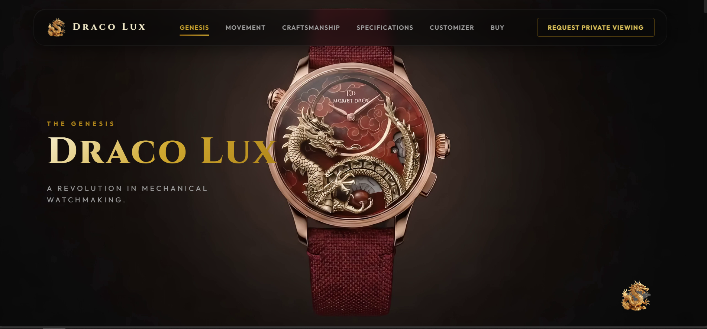

# ABDUL HANAN — CINEMATIC AI-POWERED PORTFOLIO

An Awwwards-inspired, high-performance cinematic portfolio built with **React 19**, **TypeScript**, **Vite**, **Tailwind CSS v4**, **GSAP ScrollTrigger**, **Lenis Smooth Scroll**, and **Matter.js 2D Rigid Physics**.



## ✨ Key Features

- **240-Frame Canvas Sequence Engine**: Instant initial frame rendering, off-thread `createImageBitmap` preloading, and windowed GPU texture memory cleanup.
- **Multilingual Name Scramble**: Live 3s matrix scramble rotation across English, Chinese, Russian, Urdu, Hindi, and German.
- **Editorial Scroll-Driven Typography Reveal**: GSAP ScrollTrigger word-by-word reading reveal from light gray (`#7A7A7A`) to pure white (`#FFFFFF`) and dark red (`#990000`) accents.
- **Matter.js Interactive Tech Playground**: Tangible 2D physics container with draggable, stackable transparent PNG technology logos.
- **Floating Matrix Scramble CTA**: Matrix character scramble hover effect with Telegram icon (`FaTelegramPlane`) and section auto-hide behavior.
- **Responsive Mobile Drawer**: Glassmorphism mobile menu drawer (`HiMenuAlt3`) with smart scroll-hide navbar behavior.

## 🛠️ Technology Stack

- **Core Engine**: React 19, TypeScript, Vite
- **Styling**: Tailwind CSS v4, Vanilla CSS Design System, Pangram Pangram Thunder Font Stack
- **Animation & Physics**: GSAP, ScrollTrigger, Lenis Smooth Scroll, Matter.js
- **Icons**: React Icons

## 🚀 Quick Start

```bash
# Clone the repository
git clone https://github.com/im-abdulhanan/my-new-Portfolio-.git

# Navigate to project directory
cd my-new-Portfolio-

# Install dependencies
npm install

# Start local development server
npm run dev

# Build for production
npm run build
```

## ⚡ Deployment

Designed and optimized for seamless 1-click deployment on **Vercel** or **Netlify**.

---

Designed & Engineered by **Abdul Hanan**
